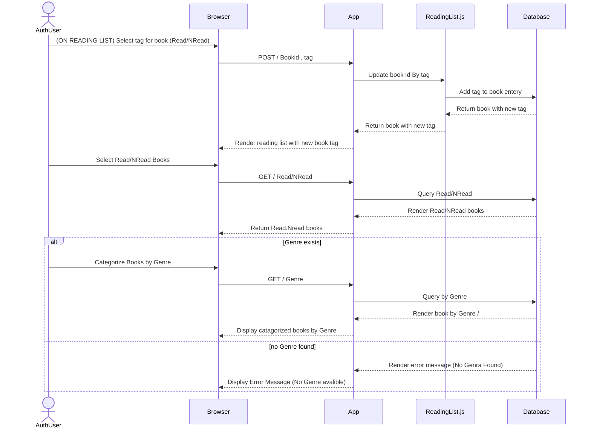

```mermaid

sequenceDiagram
actor AuthUser
participant Browser
participant App
participant ReadingList.js
participant Database


AuthUser ->>Browser:(ON READING LIST) Select tag for book (Read/NRead) 
Browser ->>App: POST / Bookid , tag
App ->>ReadingList.js: Update book Id By tag
ReadingList.js ->>Database: Add tag to book entery
Database -->>ReadingList.js: Return book with new tag
ReadingList.js -->>App: Return book with new tag
App -->>Browser: Render reading list with new book tag

AuthUser ->>Browser: Select Read/NRead Books 
Browser ->>App: GET / Read/NRead
App ->>Database: Query Read/NRead
Database -->>App: Render Read/NRead books
App -->>Browser: Return Read.Nread books


alt Genre exists
AuthUser ->>Browser: Categorize Books by Genre
Browser ->>App: GET / Genre
App ->>Database: Query by Genre
Database -->>App: Render book by Genre / 
App -->>Browser: Display catagorized books by Genre
Else no Genre found
Database -->>App: Render error message (No Genra Found) 
App -->>Browser: Display Error Message (No Genre avalible)

end


```