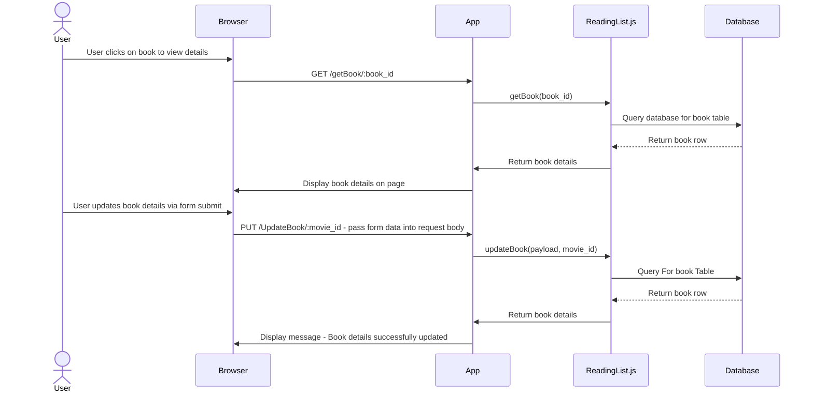

```mermaid
sequenceDiagram
    actor User
    participant Browser
    participant App
    participant ReadingList.js
    participant Database

    User->>Browser: User clicks on book to view details
    Browser->>App: GET /getBook/:book_id
    App->>ReadingList.js: getBook(book_id)
    ReadingList.js->>Database: Query database for book table
    Database-->>ReadingList.js: Return book row
    ReadingList.js->>App: Return book details
    App->>Browser: Display book details on page 
    
    User->>Browser: User updates book details via form submit
    Browser->>App: PUT /UpdateBook/:movie_id - pass form data into request body
    App->>ReadingList.js: updateBook(payload, movie_id)
    ReadingList.js->>Database: Query For book Table
    Database-->>ReadingList.js: Return book row
    ReadingList.js->>App: Return book details
    App->>Browser: Display message - Book details successfully updated
    


```